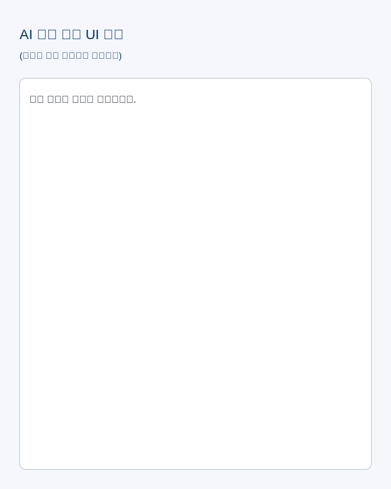

# 금융 뉴스 AI 분석 서비스 - 프론트 우선 개발 전략

## 프로젝트 개요
- 금융 뉴스 기사 텍스트를 입력하면 AI가 요약, 감정 분석, 핵심 포인트를 자동으로 추출하는 시스템.
- 최종 목표: FastAPI 기반 Hexagonal Architecture 백엔드와 PDF 보고서 제공 기능을 갖춘 분석 플랫폼.

## 프론트엔드 우선 접근 이유
1. **UI 기획(v0) 완료**: 화면 흐름이 명확하여 백엔드를 기다리지 않고 UX 중심 개발 가능.
2. **인터페이스 분리**: API Layer를 추상화하면 추후 FastAPI 교체가 용이.
3. **Mock 데이터 활용**: 사용자 흐름을 빠르게 검증하고 기능 요구사항을 확정.

## API 계약 (프론트 ↔ 백엔드)
- **Endpoint**: `POST /news/analyze`
- **Request Body**
  ```json
  { "article": "기사 내용 텍스트" }
  ```
- **Response Body**
  ```json
  {
    "sentiment": "positive | neutral | negative",
    "key_points": ["핵심요약1", "핵심요약2", "..."]
  }
  ```

### TypeScript DTO
```ts
export type Sentiment = "positive" | "neutral" | "negative";

export interface AnalyzeNewsRequest {
  article: string;
}

export interface AnalyzeNewsResponse {
  sentiment: Sentiment;
  key_points: string[];
}
```

## Mock API (프론트 테스트용)
```ts
export async function analyzeNewsMock(
  req: AnalyzeNewsRequest
): Promise<AnalyzeNewsResponse> {
  await new Promise((r) => setTimeout(r, 1500));
  return sampleAnalysis;
}
```

## FastAPI 연동 시 교체 함수
```ts
export async function analyzeNewsApi(
  req: AnalyzeNewsRequest
): Promise<AnalyzeNewsResponse> {
  return fetch(`${process.env.NEXT_PUBLIC_API_BASE_URL}/news/analyze`, {
    method: "POST",
    headers: { "Content-Type": "application/json" },
    body: JSON.stringify(req),
  }).then((res) => res.json());
}
```

> 프론트는 동일 인터페이스를 유지하고 백엔드 구현만 교체하는 전략을 사용합니다.

## 백엔드 설계 방향 (Hexagonal Architecture)
- **Domain**: 금융 기사 엔티티 및 분석 결과 모델 정의
- **Application (Use Case)**: `AnalyzeNewsUseCase`에서 입력 처리 및 규칙 적용
- **Infrastructure**: OpenAI 클라이언트 및 외부 뉴스 API 어댑터
- **Presentation**: FastAPI 라우터 (`POST /news/analyze`)

## 다음 단계
1. FastAPI 라우터 및 Pydantic 모델 정의.
2. OpenAI 기반 분석(요약, 감정, 핵심 포인트) 구현.
3. 프론트 Mock에서 실제 API(`analyzeNewsApi`)로 전환.

## UI 참고
아래 화면을 기준으로 UX를 구현합니다.


